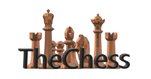
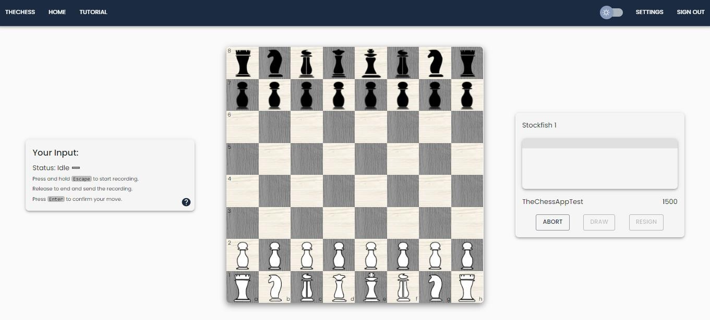

# the-chess

Part of my group's thesis project for our bachelor degree.

The Chess is an online chess platform that features speech-to-text Google AI used to allow players to play by using their voice. It is integrated with lichess.org API, allowing players to login and play against other lichess.org users. 

This project is primarily aimed to provide a platform for players to play blind chess online with the use of voice. 

Reactjs is used for its frontend and Java Spring Boot for its backend.

